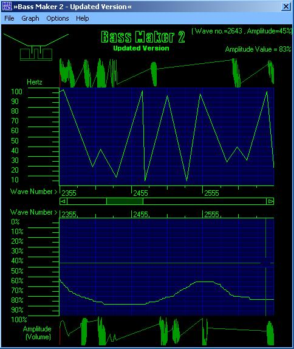



## Bass Maker 2 \- Updated Version

### Description

.Title:- Bass Maker 2 (Updated Version)

.Description:- Make wave files with nothing but pure bass!! Watch your subwoofer pump in and out!! Bass Maker 2 can also work with higher frequencies to produce loud ear piercing treble for use with tweeters. There have been several improvements on the previous version of Bass Maker like a new 'Graphical' style way of entering points. Bass Maker 2 has capabilities of storing about 10000 points, so you shouldn't run out of project space. Bass Maker 2 also has an option to compensate for the changes in wavelengths between different frequencies to make higher frequencies last for the same amount of time as low frequencies. Another improvement is simplified algorithms, which make Bass Maker 2 alot faster than the original Bass Maker. Bass Maker 2 is now using API-Guide's (www.allapi.net) commondialog to save/load files. These and many other improvements have been made upon the previous version. I hope you enjoy Bass Maker 2.

.Updates in Bass Maker 2 Updated Version:-

- Much Faster Wave File Creation.

- Alternate Commondialog Used (Code from AllAPI Guide, www.allapi.net).

- Amplitude Graph Added

- Several Minor Updates
 
### More Info
 

             |
---                |---
**Submitted On**   |2004-06-26 12:37:16
**By**             |[Alex Murray](https://github.com/Planet-Source-Code/PSCIndex/blob/master/ByAuthor/alex-murray.md)
**Level**          |Advanced
**User Rating**    |5.0 (50 globes from 10 users)
**Compatibility**  |VB 5\.0, VB 6\.0
**Category**       |[Sound/MP3](https://github.com/Planet-Source-Code/PSCIndex/blob/master/ByCategory/sound-mp3__1-45.md)
**World**          |[Visual Basic](https://github.com/Planet-Source-Code/PSCIndex/blob/master/ByWorld/visual-basic.md)
**Archive File**   |[Bass\_Maker1783558192004\.zip](https://github.com/Planet-Source-Code/alex-murray-bass-maker-2-updated-version__1-55679/archive/master.zip)

